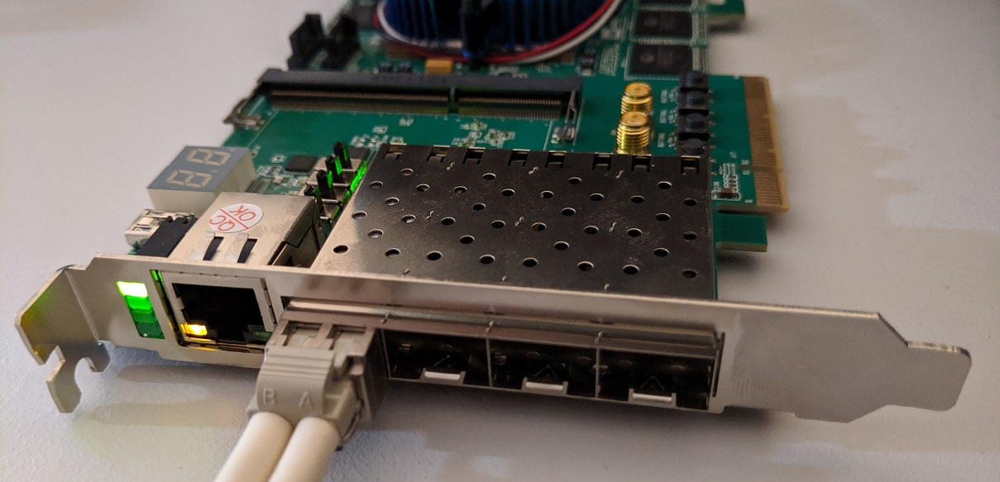
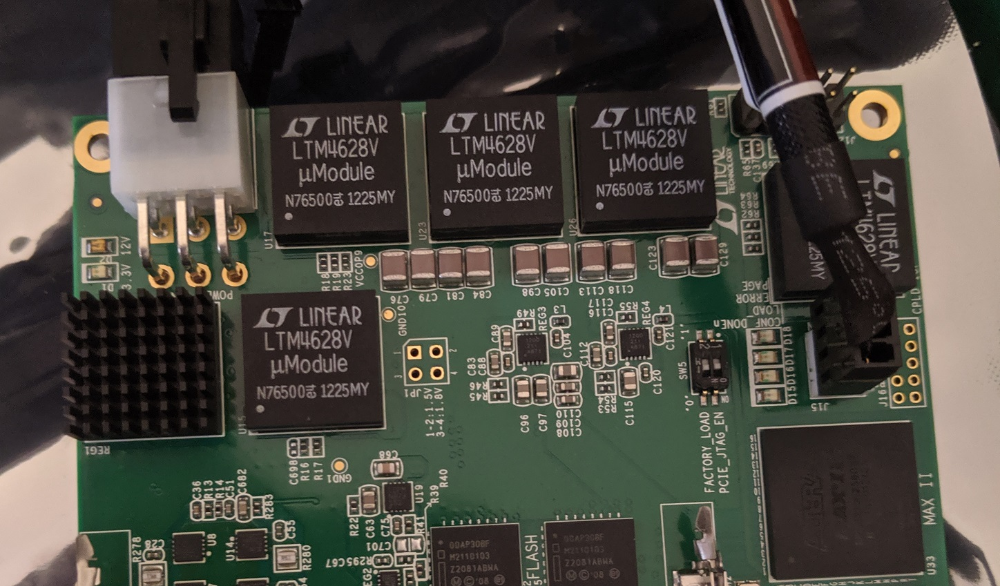

# fejkon

fejkon is a basic host bus adapter (HBA) for Fibre Channel (and thus, FICON) implemented on the DE5-Net board.
The aim is to provide easy access to add or consume Fibre Channel services, such as FCP or FICON
from an ordinary server.



Fejkon, which was born out of the need for a fake FICON HBA, is a Swedish pun playing on the word "fejk" which
translates "fake". It is pronounced similarly to the "FIC" in "FICON".

## Board

Target board right now is the DE5-Net from Terasic. They are available for $300 - $600 on eBay as of this writing
and are capable of implementing 4x 8 Gbit/s Fibre Channel ports on a PCIe Gen 3 x8 port.

There are a few modifications to the board that are recommended.

 * Remove DDR3 SODIMMs, they are not needed and contribute to power drain
 * Add a 100 Ohm resistor to the stock cooler for a better noise level, cooling performance is fine anyway
 * Add a [heatsink](https://www.mouser.ch/ProductDetail/532-375424B00034G) onto of the LTM4601V



## Developing

The recommended flow is using Quartus Platform Designer to make changes.

To build the qsys files needed simply execute `make QPATH=/path/to/quartus` in the root directory.
Then use platform designer to edit `fejkon.qsys`. When you are done, export the system
using "Export System as Platform Designer script (.tcl)" under the "File" menu. If you
have updated any subsystems you need to this for those systems as well.

Finally review any changes to the \*.tcl files and commit them if they look reasonable.

## PCIe specification

The board uses vendor/device ID `f1c0:0de5`. Mnemonic is **FICO**n **DE5**-net.

The PCIe bus has four Base Address Registers (BARs).

### BAR 0

PCIe DMA engine. TODO.

### BAR 1

PCIe DMA engine. TODO

### BAR 2

Accesses need to be 4 byte wide.

| Addr    | Width | Part   | Name          | Description                  |
|---------|-------|--------|---------------|------------------------------|
| 0x00000 | 2     | Card   | Version       | The constant 0x0DE5          |
| 0x00002 | 1     | Card   | Version       | Version of the Fejkon card   |
| 0x00003 | 1     | Card   | Port options  | Number of ports              |
| 0x00010 | 1     | Card   | Temprature    | FPGA Core Temperature (1)    |
| 0x01000 | 1     | Port 0 | SFP Status    | SFP Status Word (3)          |
| 0x01040 | 64    | Port 0 | SFP Port I2C  | SFP I2C core (4)             |
| 0x02x00 | ...   | Port 1 | SFP Port      |                              |
| 0x03x00 | ...   | Port 2 | SFP Port      |                              |
| 0x04x00 | ...   | Port 3 | SFP Port      |                              |
| 0x10000 | 4     | Port 0 | RX DMA        | DMA status (2)               |
| 0x10040 | 4     | Port 0 | TX DMA        | DMA status (2)               |
| 0x10200 | 512   | Port 0 | RX XCVR Mgmt  | V-Series Transceiver PHY (5) |
| 0x10400 | 512   | Port 0 | TX XCVR Mgmt  | V-Series Transceiver PHY (5) |
| 0x12000 | 32    | Port 0 | RX Descr 0    | DMA descriptor               |
| ...     | 32    | Port 0 | RX Descr n    | ...                          |
| 0x12FE0 | 32    | Port 0 | RX Descr 127  | ...                          |
| 0x13000 | 32    | Port 0 | TX Descr 0    | ...                          |
| ...     | 32    | Port 0 | TX Descr n    | ...                          |
| 0x13FE0 | 32    | Port 0 | TX Descr 127  | ...                          |
| 0x2xxxx | ...   | Port 1 | ...           |                              |
| 0x3xxxx | ...   | Port 2 | ...           |                              |
| 0x4xxxx | ...   | Port 3 | ...           |                              |

1) See Temperature decoding details in [FPGA Temperature Sensor IP Core User Guide](https://www.intel.com/content/dam/www/programmable/us/en/pdfs/literature/ug/ug_alttemp_sense.pdf)
2) See DMA the details for "Scatter-Gather DMA Controller Core" in
[Embedded Peripherals IP User Guide](https://www.intel.com/content/dam/www/programmable/us/en/pdfs/literature/ug/ug_embedded_ip.pdf)
3) See below
4) See "Intel FPGA Avalon I2C (Master) Core" in [Embedded Peripherals IP User Guide](https://www.intel.com/content/dam/www/programmable/us/en/pdfs/literature/ug/ug_embedded_ip.pdf)
5) See "Custom PHY" in [V-Series Transceiver PHY IP Core User Guide](https://www.intel.com/content/dam/www/programmable/us/en/pdfs/literature/ug/xcvr_user_guide.pdf)

#### SFP Port Status

| Bit(s) | Direction   | Description      |
|--------|-------------|------------------|
| 0      | Read only   | Present          |
| 1      | Read only   | Loss of Signal   |
| 2      | Read only   | TX Fault         |
| 3      | Read/Write  | TX Disable       |
| 4:5    | Read/Write  | Rate Select      |
| 6      | Read/Write  | I2C Reset        |

### BAR 3

PCIe DMA engine descriptors. TODO

### MSI Interrupts

Currently fejkon is using multiple MSI interrupts, not MSI-X. MSI-X is a bit
more complicated to implement, and the benefits of MSI-X over MSI isn't very
documented when you don't need the thousands interrupts that MSI-X offers.

During development it was discovered that e.g. QEMU does not do multiple MSI
interrupts by default, and some kernel options are needed as well. The symptom
of the platform not being setup correctly is that
`pci_alloc_irq_vectors(pcidev, 1, irqs, PCI_IRQ_ALL_TYPES);` only returns one
available vector instead of the requested number. There appears to be other
people that have ran into the
[same issue](https://stackoverflow.com/questions/34406632/is-multi-message-msi-implemented-on-linux-x86).
In the kernel this support for multiple MSI interrupts seems to be gated by
`MSI_FLAG_MULTI_PCI_MSI`.

To enable the kernel support, enable `CONFIG_IRQ_REMAP`. On Intel, you should
see mentions of `DMAR` in your dmesg. This is usually enabled by enabling VT-d.
The equivalent on AMD seems to be just IOMMU support, but that has not been verified.
PCIe hotplug has been known to cause issues, so you might want to disable that.

The configuration for QEMU is something like:
```
-machine q35,kernel-irqchip=split \
-device intel-iommu,intremap=on,device-iotlb=on \
```

Since the card only uses MSI interrupts, legacy interrupts are disabled.

So if you are designing something from scratch and have the option to use MSI
or MSI-X, this information above should tell you that maybe using MSI-X will
be easier. However, it is quite likely MSI-X has its own pitfalls.

#### Interrupts

| Vector | Description        |
|--------|--------------------|
| 0      | Card status        |
| 1      | Temp Sensor I2C    |
| 2      | Port 0 RX DMA      |
| 3      | Port 0 TX DMA      |
| 4      | Port 0 SFP status  |
| 5      | Port 0 SFP I2C     |
| 6-9    | Port 1 ...         |
| 10-13  | Port 2 ...         |
| 14-17  | Port 3 ...         |

## Debugging

Use `make syscon` to launch Intel's System Console. It will guide you through
the debug commands, but here is an example of reading the SFP data from port 1:

```
=> Fejkon system console initialized

 Master is available at $m

 E.g:
 - master_write_32 $m 0x000e0000 5
 - jtag_debug_reset_system $m
 - sfp 1

% sfp 1
 SFP status: 0x02
 SFP identifier: 0x03
 SFP ext. identifier: 0x04
 SFP connector: 0x07
 SFP vendor: 'JDS UNIPHASE    '
 SFP vendor PN: 'JSM-21S0AA1     '
 SFP vendor SN: 'F44939581059    '
```

The design has been compiled with instrumentation of some key data buses which
you can inspect using `make syscon` by loading the `fejkon.sof` and using
"Bus Analyzer (Beta)".

If you need to debug a particular component, then using Signal Tap is
recommended.

## Known Issues

These are some changes you might need to make to build under Quartus 19.1.

### MSI limit to 32

For some reason the limit is set to 16 in the stock IP. Change it to 32.

```patch
--- /home/bluecmd/intelFPGA/19.1/ip/altera/altera_pcie/altera_pcie_hip_256_avmm/pcie_256_avmm_parameters.tcl.org	2019-10-07 22:32:09.828337496 +0200
+++ /home/bluecmd/intelFPGA/19.1/ip/altera/altera_pcie/altera_pcie_hip_256_avmm/pcie_256_avmm_parameters.tcl	2019-10-07 22:32:18.536266216 +0200
@@ -731,7 +731,7 @@
 
    add_parameter          msi_multi_message_capable_hwtcl string        "4"
    set_parameter_property msi_multi_message_capable_hwtcl DISPLAY_NAME "Number of MSI messages requested"
-   set_parameter_property msi_multi_message_capable_hwtcl ALLOWED_RANGES { "1" "2" "4" "8" "16"}
+   set_parameter_property msi_multi_message_capable_hwtcl ALLOWED_RANGES { "1" "2" "4" "8" "16" "32"}
    set_parameter_property msi_multi_message_capable_hwtcl GROUP $group_name
    set_parameter_property msi_multi_message_capable_hwtcl VISIBLE true
    set_parameter_property msi_multi_message_capable_hwtcl HDL_PARAMETER true
```

### Confused Perl

The temporary LED driver will not generate without this pretty weird hack.
This issue appeared in 19.1 and hopefully will be patched by Intel soon.

```
sudo mkdir -p /tools/perl/5.28.1/linux64/
sudo ln -sf /home/bluecmd/intelFPGA/19.1/quartus/linux64/perl/lib /tools/perl/5.28.1/linux64/
```

## Possible future work

 * Integrate the MAX1619 sensor

The MAX1619 is an SMBus temperature sensor supported by the Linux kernel. It
would allow for more temperature data. However, SMBus seems to be incompatible
with the Intel I2C core, and no replacement core seems to be easily avaiable.
This means writing an SMBus controller, QEMU model, Linux and driver for it.

An alternative is to re-use Terasic's NIOS drivers and create an enviromental
processor that controls not only the temperature sensor but also the fan.
However, this breaks the "keep it simple" methodology currently in use.

 * Over-temperature auto-shutdown

The Intel FPGAs do not feature a protective auto-shutdown as Xilinx FPGAs do.
It would be useful to enter some kind of low-power mode if an over-temperature
condition is detected.

Possibly integrated with the above work.
