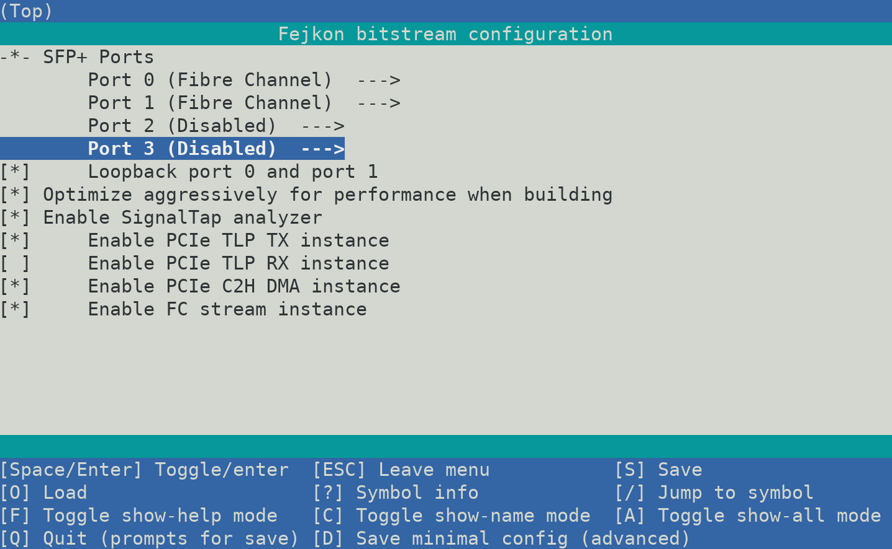

# fejkon

**Status: Sleeping ([#72](https://github.com/bluecmd/fejkon/issues/72)).**

fejkon is a basic host bus adapter (HBA) for Fibre Channel (and thus, FICON) implemented on the DE5-Net board.
The aim is to provide easy access to add or consume Fibre Channel services, such as FCP or FICON
from an ordinary server.


Fejkon, which was born out of the need for a fake FICON HBA, is a Swedish pun playing on the word "fejk" which
translates "fake". It is pronounced similarly to the "FIC" in "FICON".

It is meant to be one of the possible access ports to [fikonfarm](https://github.com/bluecmd/fikonfarm) enabling
IBM mainframes to e.g. use [Hercules](https://en.wikipedia.org/wiki/Hercules_(emulator)) disks natively.

In the past there existed a commerical product called FLEXCUB that seems to
have done something similar for ESCON.

## Design

The overall system design is as shown below. Using quad SFP+ ports Fejkon is
configured to communicate using 8GFC (no speed negotiation will be implemented).

```
8G Fibre Channel

 +-----------+
 | FC Port 0 +<-------------------------------+
 +-----+-----+                                |
       ^                                      |
       |  (Optional) Traffic Bridging         |
       v                                      |
 +-----+-----+                                |
 | FC Port 1 +<--------+                      v
 +-----------+         |        +-------------+--------------+
                       +------->+                            |        +----------------+
 +-----------+                  |                            |        |                |
 | FC Port 2 +<---------------->+       Packet Stream        +<------>+  PCIe 3.0 x8   |
 +-----------+                  |   Input/Output Mux/Demux   |        |                |
                       +------->+                            |        +----------------+
 +-----------+         |        |                            |
 | FC Port 3 +<--------+        +----------------------------+
 +-----------+
```

## Board

Target board right now is the DE5-Net from Terasic. They are available for $300 - $600 on eBay as of this writing
and are capable of implementing 4x 8 Gbit/s Fibre Channel ports on a PCIe Gen 3 x8 port.

There are a few modifications to the board that are recommended.

 * Remove DDR3 SODIMMs, they are not needed and contribute to power drain
 * Add a [heatsink](https://www.mouser.ch/ProductDetail/532-375424B00034G) onto of the LTM4601V


## Configuring and Building

FPGA tooling can be a bit stuborn to work with, and if you do not have an FPGA
background you might not want to use them.

Fejkon uses Kconfig menu configuration for configuring the board features, and
can be configured and built like this:

```
$ pip3 install kconfiglib     # Required build dependency
$ make menuconfig             # Optional: Change configuration
$ make
```

The configuration interface looks like this:



## Usage Notes

Hopefully the card is straight forward to use, but every product needs
a manual. This is it.

### Port Status

The leds on the front of the card next to the RJ45 port signals when
the port is considered active. This means for FC that the port state
machine has entered the ACTIVE state.

The leds next to the four switches on the board indicate if the transmit
laser is activated.

The leds next to the SFP cages indicate whether or not an SFP module is
detected in that slot.

### Cooling

The fan is configured to only turn on when the temperature reaches 60°C.
If that happens the fan will remain on until the board has been reset.

### Wireshark / tcpdump

libpcap defaults to DLT_FC2 which does not account for SOF/EOF which are
included in fejkon - so you need to tell it that those are included.

Example:
```
tshark -i fc0 -y FC_2_WITH_FRAME_DELIMS
```

### MSI Interrupts

Currently fejkon is using multiple MSI interrupts, not MSI-X. MSI-X is a bit
more complicated to implement, and the benefits of MSI-X over MSI isn't very
documented when you don't need the thousands interrupts that MSI-X offers.

During development it was discovered that e.g. QEMU does not do multiple MSI
interrupts by default, and some kernel options are needed as well. The symptom
of the platform not being setup correctly is that
`pci_alloc_irq_vectors(pcidev, 1, irqs, PCI_IRQ_ALL_TYPES);` only returns one
available vector instead of the requested number. There appears to be other
people that have ran into the
[same issue](https://stackoverflow.com/questions/34406632/is-multi-message-msi-implemented-on-linux-x86).
In the kernel this support for multiple MSI interrupts seems to be gated by
`MSI_FLAG_MULTI_PCI_MSI`.

To enable the kernel support, enable `CONFIG_IRQ_REMAP`. On Intel, you should
see mentions of `DMAR` in your dmesg. This is usually enabled by enabling VT-d.
The equivalent on AMD seems to be just IOMMU support, but that has not been verified.
PCIe hotplug has been known to cause issues, so you might want to disable that.

The configuration for QEMU is something like:
```
-machine q35,kernel-irqchip=split \
-device intel-iommu,intremap=on,device-iotlb=on \
```

Since the card only uses MSI interrupts, legacy interrupts are disabled.

So if you are designing something from scratch and have the option to use MSI
or MSI-X, this information above should tell you that maybe using MSI-X will
be easier. However, it is quite likely MSI-X has its own pitfalls.

### SFP Diagnostics Data

Fejkon exposes the I2C interfaces through the Linux kernel's
[native I2C interface](https://www.kernel.org/doc/Documentation/i2c/dev-interface).
This means that accessing the SFP diagnostics data is possible using any standard
I2C library.

The recommended way to browse SFP data is using
[Safaripark](https://github.com/bluecmd/safaripark), but there is also a
simple CLI tool located in `driver/cmd/fejkon-sfp`.


## Developing

The recommended flow is using Quartus Platform Designer to make changes.

To build the qsys files needed simply execute `make QPATH=/path/to/quartus` in the root directory.
Then use platform designer to edit `fejkon.qsys` using `make edit-clean`.
When you are done, export the system
using "Export System as Platform Designer script (.tcl)" under the "File" menu. If you
have updated any subsystems you need to this for those systems as well.

Finally review any changes to the \*.tcl files and commit them if they look reasonable.

To run the tests first install the dependencies:

```
# NOTE: You need Icarus Verilog 11.0 or newer, or always_* constructs will
# not be accepted.
$ sudo apt install iverilog gtkwave verilator
$ sudo apt install python3-pip
$ pip3 install cocotb
```

Then to execute all tests run:
```
$ make -j test
```

NOTE: The driver tests are located under `driver` and are not automatically run.

## PCIe specification

The board uses vendor/device ID `f1c0:0de5`. Mnemonic is **FICO**n **DE5**-net.

The PCIe endpoint has one Base Address Register (BAR).

```

                                          Avalon-St               Avalon-MM
                                   +-------------------+      +---------------->   BAR 0
                                   |                   |      |
                                   |                   v      |
                                   |           +-------+------+--------+
                                   |           |                       |
                                   |           |   Fejkon PCIe Data    +<------+   Packet Data DMA
                                +--+--+        |       Facility        +------->   TX/RX Avalon-St
                                |     |        |                       |
                                |  A  |        +---+-------+-------+---+
                                |     |            |       |       |
                                |  D  |            v       v       v
+----------------------+        |     |         +--+--+-+--+--+-+--+--+
|                      |        |  A  |         |     | |     | |     |
|                      +------->+     |         |  F  | |  F  | |  F  |     3 TLP streams:
|    Intel PCIe Core   |        |  P  |         |  I  | |  I  | |  I  |     * Packet Data (DMA)
|                      +<-------+     |         |  F  | |  F  | |  F  |     * Failed Completions
|                      |        |  T  |         |  O  | |  O  | |  O  |     * Successful Completions
+----------+-----------+        |     |         |     | |     | |     |
           ^                    |  E  |         +--+--+ +--+--+ +--+--+
           |                    |     |            |       |       |
           v                    |  R  |            v       v       v
                                |     |         +--+-------+-------+--+
      PCIe 3.0 x8               +--+--+         |                     |
                                   ^            |     Stream Mux      |
                                   |            |                     |
                                   |            +----------+----------+
                                   |                       |
                                   |       Avalon-St       |
                                   +-----------------------+
```

The design uses components from Quartus Platform Design to minimize development
and debug time. All FPGA platforms offer some sort of FIFOs and streaming
interface that allows merging, so there is little value re-inventing those.

The PCIe adapter is a bug-fix for the V-Series Intel PCIe core where the
streaming interface is not correctly defined to be Avalon-ST compliant. See
the section about Intel PCIe TLP adapter below for details.


### BAR 0

Accesses need to be 4 byte wide.

| Addr   | Width | Part   | Name          | Description                  |
|--------|-------|--------|---------------|------------------------------|
| 0x0000 | 2     | Card   | Version       | The constant 0x0DE5          |
| 0x0002 | 1     | Card   | Version       | Version of the Fejkon card   |
| 0x0003 | 1     | Card   | Port options  | Number of ports              |
| 0x0004 | 4     | Card   | Git hash      | Git hash of HDL built        |
| 0x0010 | 1     | Card   | Temprature    | FPGA Core Temperature (1)    |
| 0x0020 | 4     | Card   | Freq. Gauge   | PHY effective clock gauge    |
| 0x0024 | 4     | Card   | Freq. Gauge   | PCIe effective clock gauge   |
| 0x0040 | 64    | Card   | FC Dbg & Gen  | Inspect / Inject point       |
| 0x0100 | 1     | Port 0 | SFP Status    | SFP Status Word (3)          |
| 0x0140 | 64    | Port 0 | SFP Port I2C  | SFP I2C core (4)             |
| 0x02x0 | ...   | Port 1 | SFP Port      |                              |
| 0x03x0 | ...   | Port 2 | SFP Port      |                              |
| 0x04x0 | ...   | Port 3 | SFP Port      |                              |
| 0x0800 | 1024  | Card   | PCIe Facility | PCIe counters and status (2) |
| 0x8000 | 2048  | Port 0 | FC XCVR IP    | Fejkon FC XCVR Core (5)      |
| 0x8800 | 2048  | Port 0 | TX XCVR Mgmt  | V-Series Transceiver PHY (6) |
| 0x9000 | 64    | Port 0 | FC Framer     | Fibre Channel Framer (7)     |
| 0x9100 | 8     | Port 0 | PCIe CDC FIFO | (Undoc.) fc0\_rx\_cdc        |
| 0xAxxx | ...   | Port 1 | ...           |                              |
| 0xCxxx | ...   | Port 2 | ...           |                              |
| 0xExxx | ...   | Port 3 | ...           |                              |
| 0xFE00 | 512   | Card   | XCVR Reconfig | (Undoc.) xcvr\_reconfig      |

1) Details in section below
2) Details in section below
3) Details in section below
4) See "Intel FPGA Avalon I2C (Master) Core" in [Embedded Peripherals IP User Guide](https://www.intel.com/content/dam/www/programmable/us/en/pdfs/literature/ug/ug_embedded_ip.pdf)
5) Details in section below
6) See "Custom PHY" in [V-Series Transceiver PHY IP Core User Guide](https://www.intel.com/content/dam/www/programmable/us/en/pdfs/literature/ug/xcvr_user_guide.pdf)
7) Details in section below

#### PCIe Facility

| Addr  | Width | Name                              |
|-------|-------|-----------------------------------|
| 0x000 | 2     | Endpoint address                  |
| 0x002 | 2     | Internal status                   |
| 0x004 | 4     | RX TLP counter                    |
| 0x008 | 4     | RX Unsupported TLP counter        |
| 0x00C | 4     | TX Data TLP counter               |
| 0x010 | 4     | TX Instant TLP counter            |
| 0x014 | 4     | TX Response TLP counter           |
| 0x018 | 4     | C2H Staging Packets counter       |
| 0x020 | 32    | Last RX TLP (8 DWs)               |
| 0x040 | 32    | Last TX Data TLP (8 DWs)          |
| 0x060 | 32    | Last TX Instant TLP (8 DWs)       |
| 0x080 | 32    | Last TX Response TLP (8 DWs)      |
| 0x0A0 | 4     | C2H DMA buffer start address      |
| 0x0A4 | 4     | C2H DMA buffer end address        |
| 0x0A8 | 4     | C2H DMA host read pointer         |
| 0x0AC | 4     | C2H DMA card write pointer        |
| 0x0C0 | 4     | H2C DMA buffer start address      |
| 0x0C4 | 4     | H2C DMA buffer end address        |
| 0x0C8 | 4     | H2C DMA card read pointer         |
| 0x0CC | 4     | H2C DMA host write pointer        |
| 0x100 | 4     | Data TX TLP Fill Level            |
| 0x110 | 4     | Instant TX TLP Fill Level         |
| 0x120 | 4     | Response TX TLP Fill Level        |
| 0x180 | 4     | LTSSM and lane active mode        |

#### Temperature

See Temperature decoding details in [FPGA Temperature Sensor IP Core User Guide](https://www.intel.com/content/dam/www/programmable/us/en/pdfs/literature/ug/ug_alttemp_sense.pdf)

| Bit(s) | Direction   | Description      |
|--------|-------------|------------------|
| 7:0    | Read only   | A/D conv. value  |
| 8      | Read only   | A/D complete     |

#### SFP Port Status

| Bit(s) | Direction   | Description      |
|--------|-------------|------------------|
| 0      | Read only   | Present          |
| 1      | Read only   | Loss of Signal   |
| 2      | Read only   | TX Fault         |
| 3      | Read/Write  | TX Disable       |
| 4:5    | Read/Write  | Rate Select      |
| 6      | Read/Write  | I2C Reset        |

#### Fejkon FC XCVR Core

| Addr    | Width | Name                   |
|---------|-------|------------------------|
| 0x00000 | 4     | Port Status            |
| 0x00004 | 4     | Last Unknown Coded Set |
| 0x00080 | 128   | RX Primitive Counters  |
| 0x00100 | 128   | TX Primitive Counters  |

The primitive counters logged are in order:

 *  IDLE
 *  R\_RDY
 *  VC\_RDY
 *  BB\_SCS
 *  BB\_SCR
 *  SOFi2
 *  SOFn2
 *  SOFi3
 *  SOFn3
 *  SOFf
 *  EOFt
 *  EOFa
 *  EOFn
 *  EOFni
 *  NOS
 *  OLS
 *  LR
 *  LRR
 *  ARBff
 *  Unknown

The data type is unsigned 32 bit integer for the primitive counters.

##### Port Status

| Bit(s) | Description      | Values                 |
|--------|------------------|------------------------|
| 0:3    | Sync Status      | 0xf = fully synced     |
| 4:7    | Pattern detect   | 0x1 = detected         |
| 8:11   | Error detect     | >0 = error(s) detected |
| 12:15  | Disparity error  | >0 = error(s) detected |
| 16     | PLL Locked       | 1 = PLL locked         |

A fully operational port has status `0x1001f`.

#### FC Framer

Note that internally the address space is split up so that the lower half
contains registers related to receive and upper half is related to transmit.

| Addr  | Width | Name                          |
|-------|-------|-------------------------------|
| 0x000 | 4     | State                         |
| 0x004 | 4     | # of ACTIVE state transitions |
| 0x008 | 4     | # of FC frames received       |

States:

| Value | Code | Name                   |
|-------|------|------------------------|
| 0     | AC   | Active                 |
| 1     | LR1  | LR Transmit            |
| 2     | LR2  | LR Receive             |
| 3     | LR3  | LRR Receive            |
| 4     | LF1  | NOS Receive            |
| 5     | LF2  | NOS Transmit           |
| 6     | OL1  | OLS Transmit           |
| 7     | OL2  | OLS Receive            |
| 8     | OL3  | Wait for OLS           |

Note: Only ACTIVE is guaranted to be stable at numeric 0 over time.

#### FC Debug & Generator

This component is used to generate traffic for debug and development. It
generates traffic interleaved with the output of the FC subsystem, and its
output is read by both the PCIe and the future Ethernet module.

| Addr  | Width | Name                          |
|-------|-------|-------------------------------|
| 0x000 | 4     | Packet inject counter         |

#### Interrupts

| Vector | Description          |
|--------|----------------------|
| 0      | Card status          |
| 1      | RX Data available    |
| 2      | RX Packet dropped    |
| 3-6    | Port 0/1/2/3 SFP I2C |

## Debugging

Use `make syscon` to launch Intel's System Console. It will guide you through
the debug commands, but here is an example of reading the SFP data from port 1:

```
=> Fejkon system console initialized

 Master is available at $m

 E.g:
 - master_write_32 $m 0x000e0000 5
 - jtag_debug_reset_system $m
 - sfp 1

% sfp 1
 SFP status: 0x02
 SFP identifier: 0x03
 SFP ext. identifier: 0x04
 SFP connector: 0x07
 SFP vendor: 'JDS UNIPHASE    '
 SFP vendor PN: 'JSM-21S0AA1     '
 SFP vendor SN: 'F44939581059    '
```

The design has been compiled with instrumentation of some key data buses which
you can inspect using `make syscon` by loading the `fejkon.sof` and using
"Bus Analyzer (Beta)".

If you need to debug a particular component, then using Signal Tap is
recommended.

### PCIe

Look at the `pcie` syscon command to get more information. If the `My ID` row
reads all zeroes that means the host PC has rejected the card for whatever reason.

## Known Issues / Notes

### Si570

The Si570 on board appears to have the following specs:

```
Part Number: 570FAB000433DG
Product: Si570
Description: Differential/single-ended; I2C programmable XO; 10-1417 MHz
Frequency A: 100 MHz
I2C Address (Hex Format): 0
Format: LVDS
Supply Voltage: 2.5 V
OE Polarity: OE active high
Temperature Stability / Total Stability: 50 ppm / 61.5 ppm
Frequency Range: 10 - 810 MHz
Operating Temp Range (°C): -40 to +85
```

### Usage under WSL and ChromeOS Crostini

There are some known issues for running under Windows Subsystem for Linux (WSL)
and ChromeOS Crostini (external reports).

#### realloc(): invalid pointer

This seems to happen on Ubuntu 18.04 and newer, including 20.04 LTS.
When starting Quartus or some other tools they will crash with the following error message:

```
$ ~/intelFPGA/20.1/quartus/bin/quartus
realloc(): invalid pointer
zsh: abort (core dumped)  ~/intelFPGA/20.1/quartus/bin/quartus
```

This can be worked around by pre-loading the system's udev version. Exact reason why
this workaround works is not known.

```
$ export LD_PRELOAD=/lib/x86_64-linux-gnu/libudev.so.1
```

This has been [reported](https://community.intel.com/t5/Intel-FPGA-Software-Installation/Running-Quartus-Prime-Standard-on-WSL-crashes-in-libudev-so/m-p/1189032#M2129) to Intel.

#### Macro \<protected\> is undefined

This is known to happen if you apply the above `LD_PRELOAD` fix and then launch ModelSim compilation.
The bug can be triggered on normal machines as well if you accidentally applied the `LD_PRELOAD` hack to them.

For some reason ModelSim then fails to decrypt the encrypted device libraries when told to preload
a library. Note: It does not have to be udev, this has been known to fail for other preloades e.g.
in /etc/ld.so.preload.

```
# ** Error: ../intelFPGA/20.1/quartus/eda/sim_lib/mentor/stratixv_atoms_ncrypt.v(38): (vlog-2163) Macro `<protected> is undefined.
# ** Error: ../intelFPGA/20.1/quartus/eda/sim_lib/mentor/stratixv_atoms_ncrypt.v(38): (vlog-2163) Macro `<protected> is undefined.
# ** Error: (vlog-13069) ../intelFPGA/20.1/quartus/eda/sim_lib/mentor/stratixv_atoms_ncrypt.v(38): syntax error in protected region.
#
# ** Error: ../intelFPGA/20.1/quartus/eda/sim_lib/mentor/stratixv_atoms_ncrypt.v(38): (vlog-13205) Syntax error found in the scope following '<protected>'. Is there a missing '::'?
# End time: 23:08:09 on Aug 20,2020, Elapsed time: 0:00:00
# Errors: 5, Warnings: 0
 ```

This can be worked around by making sure you **do not** set `LD_PRELOAD` before running `vsim` (or `unset LD_PRELOAD`)
and making sure `/etc/ld.so.preload` does not exist.

### Intel PCIe TLP adapter

The Avalon-ST interface from the PCIe IP is not standard compliant.

Avalon-ST has a property called `firstSymbolInHighOrderBits` which is supposed
to be set to `true` when the first symbol is present in e.g. `data[255:224]`.

The PCIe IP for Qsys uses the lower bits for first symbol, but unfortunately
chose to set `firstSymbolInHighOrderBits` to `true`.

Furthermore, the `empty` signal is not compliant either.

These issues are managed by the `intel_pcie_tlp_adapter` to make the design and
testbenches being able to use Avalon-ST correctly.

## Possible future work

 * Integrate the MAX1619 sensor

The MAX1619 is an SMBus temperature sensor supported by the Linux kernel. It
would allow for more temperature data. However, SMBus seems to be incompatible
with the Intel I2C core, and no replacement core seems to be easily avaiable.
This means writing an SMBus controller, QEMU model, Linux and driver for it.

An alternative is to re-use Terasic's NIOS drivers and create an enviromental
processor that controls not only the temperature sensor but also the fan.
However, this breaks the "keep it simple" methodology currently in use.

 * Over-temperature auto-shutdown

The Intel FPGAs do not feature a protective auto-shutdown as Xilinx FPGAs do.
It would be useful to enter some kind of low-power mode if an over-temperature
condition is detected.

Possibly integrated with the above work.

 * Replace Si570 with soft core CPU

 Although writing the Si570 controller was useful, in the end it is less reliable
 and much more expensive, than using a soft core to implement the equivalent logic.
 Using a soft core like NIOS, RISC-V, or OpenRISC would make it possible to control
 clock and reset networks from the firmware of the card instead of wiring it up in
 Verilog. In the beginning I thought this would end up being simpler, and while
 it ended up being a very good learning experience if I had to do it again I would
 stick a soft core CPU on there and let it do temperature, fan, reset, and clock
 control.
