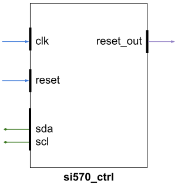

# Si570 Clock Controller

This IP core handles reset and configuration of an Si570 oscillator.

The core will communicate with the Si570 unit at 400 kHz
and configure it for a specified output frequency.

It is important that the factory recall frequency is configured
correctly. It is part dependent so it is up to you as an
implementor to correctly configure.
